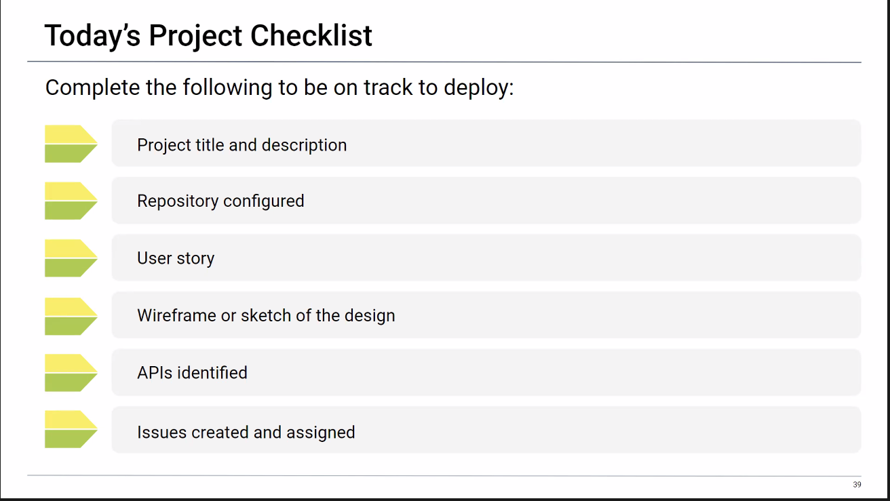

# MOTAR

## TEAM MOTAR! LETS GO!

PLEASE CREATE A NEW BRANCH TO ADD WORK...

- Project title: MOTAR (currency convertion)
- Repository: https://github.com/RickyLovesCode/MOTAR
- APIs: https://www.coingecko.com/en/api/documentation & https://marketstack.com/documentation
- Description:
  WHEN I
  THEN
- User story:
  AS a person interested in buying crypto
  I WANT TO check the most up to date conversion rates
  SO THAT I can make smart financial decisions

- Wireframe/sketch: https://wireframe.cc/lyaNqM

- API:
1-Exchange Rates https://api.coingecko.com/api/v3/exchange_rates
<<<<<<< HEAD
2- 
=======
2-Stock EOD Stats https://www.alphavantage.co/query?function=GLOBAL_QUOTE&symbol=IBM&apikey=2MTCI3582ZDMK6B2
>>>>>>> 9e0454081b6b2f4cfce1fd0963dad9c3cfc1b2b1
