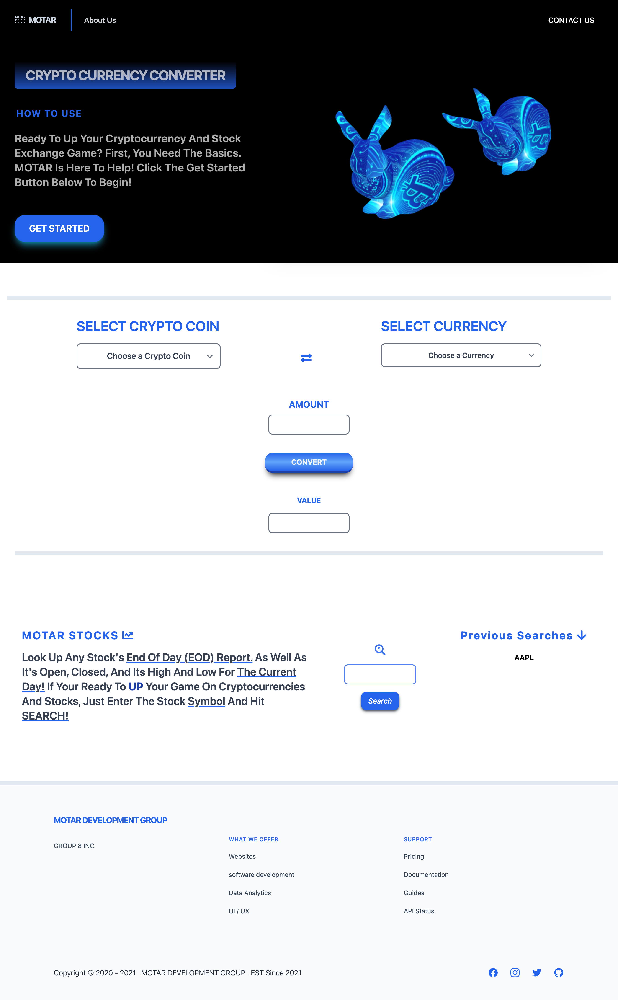

# MOTAR

## Purpose
Motar is a cryptocurrecny converter, created so that a user, who is interested in cryptocurrency can covert the cryptocurrency of their choice to a desired currency. MOTAR also allows a user to look up End of Day (EoD) data of a desired stock. MOTAR was made to be simple and easy to use. 

## How to use
You will first need to select from the "Select a Crypto coin dropdown and choose from our list of most popular coins. Second, select the desired currency that you will like to covert the cryto coin to. You have the option to then enter an amount of crytocurrency you would like to convert in the "Amount" input. Finally click on the "Convert" button and MOTAR does the rest by displaying the conversion value in the "Value" input. 

To use the stock EoD section of MOTAR, simply enter the symbol for the desired stock and press search. The EoD data will show up to the right of the search input. 

## Built With
MOTAR was built with the folling applications:
* HTML
* Tailwind CSS Framework
* JavaScript
* API 1: Exchange Rates https://api.coingecko.com/api/v3/exchange_rates
* API 2: EOD Stats https://www.alphavantage.co/query?function=GLOBAL_QUOTE&symbol=IBM&apikey=2MTCI3582ZDMK6B2
* Wireframe/sketch: https://wireframe.cc/lyaNqM

## Website: 
https://rickylovescode.github.io/MOTAR/

## Screenshot

## Contributors
Made with ❤️ by: 
* Maya Utimura
* Orlando McEwan
* Tamika Taylor
* Abe Mozahem
* Ricky Renteria

## TEAM MOTAR! LETS GO!
